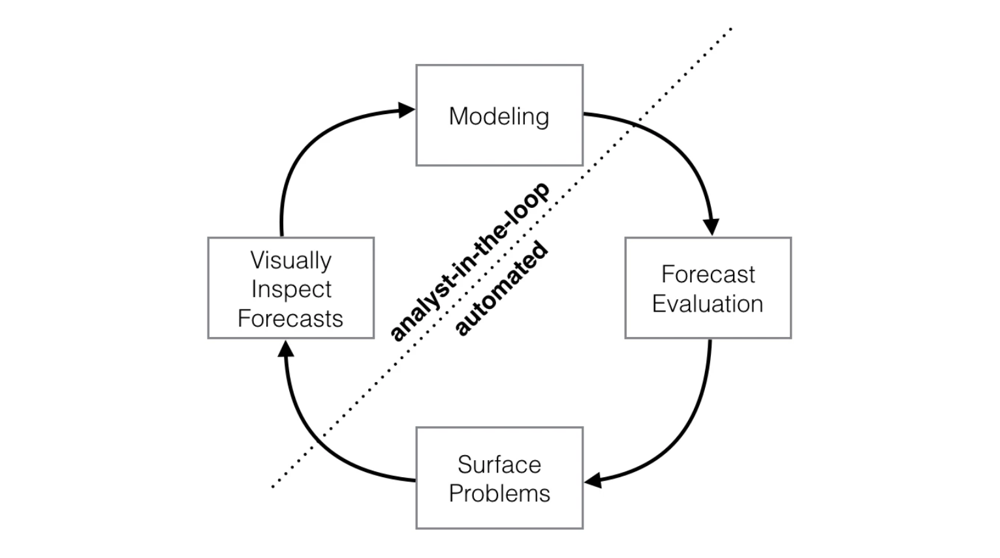
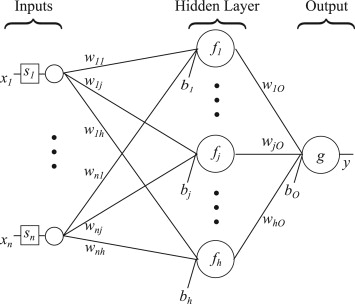

<!-- First: Set your default preferences for chunk options: -->

<!-- If you want a chunk's code to be printed, set echo = TRUE. message = FALSE stops R printing ugly package loading details in your final paper too. I also suggest setting warning = FALSE and checking for warnings in R, else you might find ugly warnings in your paper. -->

```{r setup, include=FALSE}
knitr::opts_chunk$set(echo = FALSE, message = FALSE, warning = FALSE, fig.width = 6, fig.height = 5, fig.pos="H", fig.pos = 'H')
# Note: Include = FALSE implies the code is executed, but not printed in your pdf.
# warning and message = FALSE implies ugly messages and warnings are removed from your pdf.
# These should be picked up when you execute the command chunks (code sections below) in your rmd, not printed in your paper!

# Lets load in example data, and see how this can be stored and later called from your 'data' folder.
if(!require("tidyverse")) install.packages("tidyverse")
library(tidyverse, pacman)
pacman::p_load(quantmod, ggplot2, forecast, tseries, rugarch, prophet, tsfknn, fmxdat, tidyverse,tbl2xts, kableExtra)

Example_data <- Texevier::Ex_Dat

# Notice that as you are working in a .Rproj file (I am assuming you are) - the relative paths of your directories start at your specified root.
# This means that when working in a .Rproj file, you never need to use getwd() - it is assumed as your base root automatically.
write_rds(Example_data, path = "data/Example_data.rds")

JSE_TOP40 <-  fmxdat::SA_Indexes |> filter(ShareName=="JSE Top 40 Index Total Return Value") #daily (excl weekends) data  2002-06-21 to 2020-07-31. NB, how to handle the empty weekend spots??

JSE_Top40_xts <- tbl_xts(JSE_TOP40)

```


<!-- ############################## -->
<!-- # Start Writing here: -->
<!-- ############################## -->

# Introduction \label{Introduction}

Predicting future outcomes based on historical data is known as a forecasting algorithm. Accordingly, this project implements Facebook's Prophet, the K-Nearest Neighbours (KNN), and the Feed-forward Neural Network (FNN) algorithms to predict the movement in value of the Johannesburg Stock Exchange's (JSE) Top 40 Index. Importantly, these predictions are not aimed at analysing stock price movements to provide investor insights. Instead, the purpose is to show the models fitted, compare the different forecasting approaches, and encourage their use.

Since the outset of financial markets, investor’s have been attempting to predict market trends and random behaviour. However, as indicated by some of the most formidable market investors, predicting stock market returns is almost impossible. However, all improving techniques surrounding machine learning and its implications for forecasting time series might someday provide more robust stock market predictions. It is in investigating some of these machine learning techniques that give inclination to this project.

All the models performed very well inside the prediction intervals and the accuracy metrics, with the FNN algorithm displaying the most accurate predictions. The KNN model did not serve as well as the Prophet and FNN models under our metrics. This could be because KNN may need more tuning phases, training, and testing approaches, or they are not as effective as the other models because they mainly use classificatory terms more than forecasting.

# Forecasting using the Prophet Algorithm

The Prophet model is an additive regression model developed by @taylor2018 at Facebook’s Core Data Science team, providing an effective solution to forecast time series with trending and seasonal properties. The model consists of four main components: A logistic growth curve or piecewise linear trend ($g(t)$), a yearly seasonal element using a Fourier series ($s(t)$), a weekly seasonal part using dummy variables, and the effects of holidays or significant events ($h(t)$). 

```{r, fig.cap = "The dynamics of the Prophet algorithm. \\label{image1}", out.width = "70%", fig.show = "hold", fig.align='center'}

```

Figure \ref{Prophet} compares the actual data versus the predicted values fitted using a piecewise linear trend and forecasting 500 observations in advance. Additionally, the number of lags are selected based on the Akeike Information Criteria (AIC). Visually, the predicted values seem to do the actual data rather well. However, to better understand the data generating process, the expected prophet components divided by a trend component, weekly seasonality and yearly seasonality are depicted in figure \ref{ProphetT}. Outside of the apparent weekly seasonality due to markets being closed on weekends, the predicted values show higher volatility during the year's first quarter. This evidence makes sense as most companies in the JSE Top 40 index have their financial year-end during this period.

```{r, Prophet Forecasting}
#Prophet Forecasting
#Use data frame format instead of xts data format

JSE_TOP40_df <-  data.frame(ds=index(JSE_Top40_xts), y=as.numeric(JSE_Top40_xts$Price))

prediction_prophet <- prophet(JSE_TOP40_df)

future_df <-  make_future_dataframe(prediction_prophet,periods=500)

forecast_prophet <-  predict(prediction_prophet,future_df)


```

```{r, Train predictions}
#Generating the data set based on trained predictions and compare the prophet predictions to the actual observations

predicted_df <-  data.frame(forecast_prophet$ds,forecast_prophet$yhat)

length_of_train <-  length(JSE_Top40_xts$Price)

predicted_train_df <-  predicted_df[c(1:length_of_train),]


```

```{r,  warning =  FALSE, fig.align = 'center', fig.cap = "Visualisation of Train Prediction (blue) vs Observed Data (black).\\label{Prophet}", fig.ext = 'png', fig.height = 3, fig.width = 5}

#Visualizing train prediction vs real data
g <- ggplot()+
  geom_smooth(aes(x= predicted_train_df$forecast_prophet.ds , y= JSE_Top40_xts$Price),
              colour="blue", level=0.99, fill="#69b3a2", se=T) +
  geom_point(aes(x= predicted_train_df$forecast_prophet.ds ,y=predicted_train_df$forecast_prophet.yhat), size = 0.3, colour="black")+
    labs(x = "Date",
         y = "Total Index Return",
         color = "Legend") +     ## Notice that this graph can be improved apon severely by including legends
    scale_color_manual(values = colors)+
  ggtitle("")
g


```

```{r,  warning =  FALSE, fig.align = 'center', fig.cap = "Cross validation of Prophet components controlling for trend, weekly seasonality, and yearly seasonality.\\label{ProphetT}", fig.ext = 'png', fig.height = 3, fig.width = 5}
#Here we investigate the accuracy of the predictions with cross validation

accuracy_of_forecast<- accuracy(predicted_train_df$forecast_prophet.yhat,JSE_TOP40_df$y)

detrended_forecasts <- prophet_plot_components(prediction_prophet,forecast_prophet) #To have a clearer understanding of the data generating process, I plot the forecasted prophet components divided by a trend component, weekly seasonality and yearly seasonality.


```
The corresponding statistics reflecting the accuracy of the prediction are provided in table \ref{Propheta}. All of the goodness-of-fit statistics report that the Prophet predicted values are sufficiently accurate in predicting the actual observations. For ease of interpretation we consider the Mean Absolute Percentage Error (MAPE) of 4.631%, indicating that the actual and predicted value are off by 4.63%.^[The formula for the MAPE is given by: $(1/n) \sum_{t=1}^T|\frac{actual \ value-predicted \ value}{actual \ value}| \times 100.$]  

```{r, results='asis'}

knitr::kable(accuracy_of_forecast, align = 'c', digits = 3, format = "latex",
      caption = 'Goodness of fit statistics reflecting the accuracy of the Prophet model forecasts. \\label{Propheta}', booktabs=T, escape=F) |> kable_styling(full_width = T)

```

# The K-Nearest Neighbours (KNN) Algorithm 

The K-Nearest Neighbours (KNN) algorithm is a supervised machine learning algorithm first introduced by @keller1985. The algorithm applies a method of classifying data to estimate the likelihood that a data point will become a member of one group or another depending on the group to which the data points nearest to it belong (the training set). In this section, our primary objective is to forecast values for the JSE Top 40 index through a KNN experimental approach and compare its forecast accuracy with the other models adopted.

The following 500 values forecasted are shown in figure \ref{KNN}. The number of parameters in the KNN regression is set to 100 because this project focuses on comparing different projection models rather than deducing the actual movement of stock prices. Furthermore, the lags are selected based on the AIC, and recursive methods are applied as the multiple-step ahead strategy.^[See @taunk2019 for a detailed description of the intricacies surrounding the KNN algorithm.]

```{r,  warning =  FALSE, fig.align = 'center', fig.cap = "Forecasted JSE Top 40 index using the k-nearest neigbours algorithm.\\label{KNN}", fig.ext = 'png', fig.height = 3, fig.width = 5}


# Remember here to justify the selection of the k-value, the lags, as well as the msas. # Do so by comparing the RMSE, MAE, and the MAPE values for different specifications. 

KNN_prediction <- knn_forecasting(JSE_TOP40_df$y, h = 500 , lags = 1:30, k = 30, msas = "MIMO" ) 

#'h is the number of values to forecast'. 'k' is the parameter in the KNN regression. 'lags' is the order of lags used in the AR process. 'msas' is a string indicating the Multiple-Step Ahead Strategy used when more than one value is predicted. It can be "recursive" or "MIMO" (the default). 

#Accuracy of the model's training  set 

rolling_origin <- rolling_origin(KNN_prediction)

#print(rolling_origin$global_accu)  # Provides the RMSE, MAE and the MAPE

autoplot(KNN_prediction) +
    labs(x = "Time", y = "Total Index Return")

```

The forecasts depicted in figure \ref{KNN} indicate that the JSE Top 40 index will experience growth, with a marginally slight decline after two months that recovers rather quickly towards its stable growth path. The statistics that measure the accuracy of the prediction are given in table \ref{KNNa} below. Again, referring to the MAPE value of 6.95%, the projections fit the actual data sufficiently, with a 6.95% error between the predicted and actual values. However, this is a slightly worse fit than the predictions computed using the Prophet algorithm.

```{r, results='asis'}

knitr::kable(rolling_origin$global_accu, align = 'c', digits = 3, format = "latex",
      caption = 'Goodness of fit statistics reflecting the accuracy of the KNN algorithms forecasts. \\label{KNNa}', booktabs=T, escape=F) |> kable_styling(full_width = T)


```

# The Feed-forward Neural Network (FNN)

```{r, fig.cap = "The dynamics of the feed-forward neural network algorithm. \\label{image2}", out.width = "55%", fig.show = "hold", fig.align='center'}

```

A single hidden layer feed-forward neural network (FNN) is the first and most straightforward kind of artificial neural network where connections between nodes do not form a loop or cycle [@sanger1989].  Consequently, the information only flows forward from the input nodes through the hidden nodes and to the output nodes. In its form considered here, only one layer of input nodes transmits weighted inputs to the next layer of receiving nodes.

This section fits a single hidden layer FNN to the JSE Top 40 time series. Similar to the approach by @wang2014, the functional model involves using lagged values of the process as the input data, resulting in an estimated non-linear autoregressive model. 

The specific number of hidden nodes is half the number of input nodes, including external independent variables, plus one. To ensure that the residuals will be approximately homoscedastic, the Box-Cox lambda approach is used. In figure \ref{FNN}, the following 500 values are forecasted with the neural net fitted and the number of lags selected based on the AIC. In contrast to the Prophet and KNN predictions, figure \ref{FNN} predicts that the JSE Top 40 index will experience a sharp decline until levelling off approximately three months later.

```{r,  warning =  FALSE, fig.align = 'center', fig.cap = "Forecasted JSE Top 40 index using the feed-forward neural network.\\label{FNN}", fig.ext = 'png', fig.height = 3, fig.width = 5}


#Fitting  the nnetar

Lambda = BoxCox.lambda(JSE_Top40_xts$Price) 

# I select the specific number of hidden nodes is half of the number of input nodes (including external regressors, if given) plus 1.
# To ensure that the residuals will be approximately homoscedastic, a Box Cox lambda is approach is applied. I forecast the next 500 values with the neural net fitted. I then proceed to apply the nnetar function with the lambda assigned as parameters.

FNN_fit = nnetar(JSE_Top40_xts$Price,lambda=Lambda)

#FNN_fit # See the output results 

FNN_forecast <-  forecast(FNN_fit,PI=T,h=500) # Forecast 500 periods (week days) ahead as in previous predictions.
  
autoplot(FNN_forecast)+
    labs(x = "Time", y = "Total Index Return", title = "") # A completely opposite result to KNN forecast. 

```

The accuracy statistics are given in table \ref{FNNa} below. The MAPE of 0.95 is an improvement on both the Prophet and KNN predictions, indicating that the actual and forecasted values are off by 0.95%.

```{r, Accuracy of FNN Forecast, results='asis'}

acc_FNN<- accuracy(FNN_fit) # Interpreting the forecasts. 

knitr::kable(acc_FNN, align = 'c', digits = 3, format = "latex",
      caption = 'Goodness of fit statistics reflecting the accuracy of the FNN algorithms forecasts. \\label{FNNa}', booktabs=T, escape=F) |> kable_styling(full_width = T)


```

# Conclusion

This study focused on applying different models, learning how to use them to forecast JSE Top 40 index values, and showcasing contrasting results. The Prophet and KNN algorithms predicted a price increase over the next 500 days, whereas the FNN algorithm a price decrease.

All the models performed very well inside the prediction intervals and the accuracy metrics, with the FNN algorithm displaying the most accurate predictions. The KNN model did not serve as well as the Prophet and FNN models under our metrics. This could be because KNN may need more tuning phases, training, and testing approaches, or they are not as effective as the other models because they mainly use classificatory terms more than forecasting.


<!-- Make title of bibliography here: -->
<!-- \newpage -->

\newpage

# References {-}

<div id="refs"></div>


